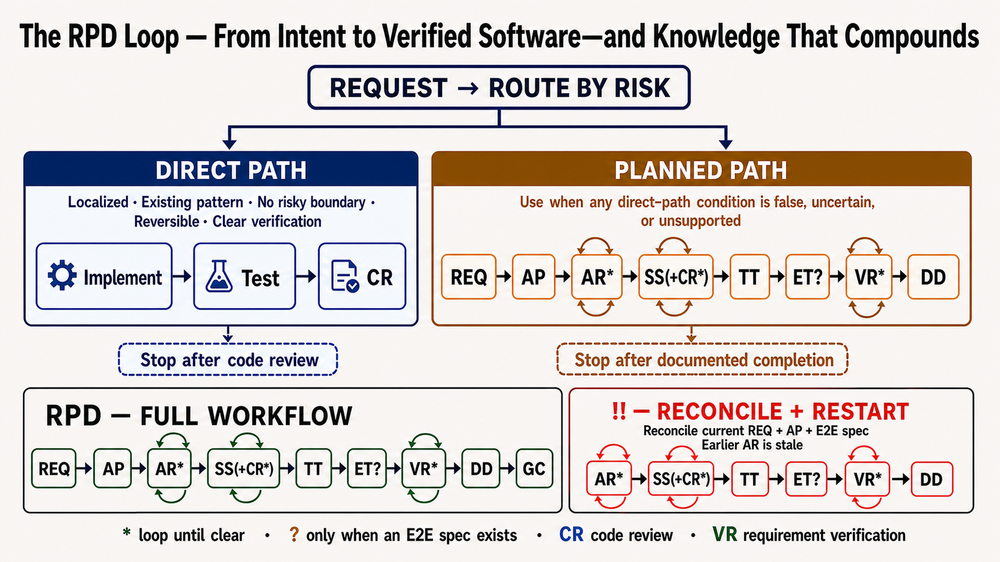

# RPD - Requirements, Planning, and Development Workflow

An AI agent skill that provides a structured workflow for requirements, planning, architecture review, implementation, verification, review, documentation, E2E execution, and commit. Works with Claude Code, Cursor, Copilot, Codex, Windsurf, Cline, Aider, and other AI coding tools.


RPD gives you 12 workflow commands you can use in conversation to drive a systematic development process.

## Intent Routing

- Interpret ordinary natural-language requests by their requested outcome. Requests limited to explanation, diagnosis, review, requirements, planning, or architecture review do not authorize implementation. Explicit CR and VR retain their documented behavior.
- Treat explicit REQ, AP, AR, and DD invocations as stage selectors. Perform only the documented stage; they do not implicitly authorize source changes.
- Treat explicit `!!` as a current-story correction and full-flow restart. Reconcile the current story's REQ, AP, and E2E spec, then continue through the RPD sequence without asking for a second implementation approval.
- Treat a natural-language request that clearly asks to implement, fix, add, remove, or change repository behavior as implementation authorization. Do not require a special command token or ask for a second approval.
- Use direct implementation only when focused repository evidence shows that the work is localized, follows an existing pattern, changes no public API, schema, persistence, migration, authentication, security, privacy, external integration or dependency contract, infrastructure, deployment, concurrency, performance, availability, or reliability behavior, is readily reversible, and has clear expected behavior and verification.
- File count, estimated effort, and textual diff size are not routing criteria. A one-line security or public-contract change requires planned routing; a multi-file internal mechanical change may qualify for direct implementation.
- If any direct-path condition is false, uncertain, or unsupported, create or update REQ and AP, run AR, and continue into implementation after AR passes when RPD auto-entered planning from the natural-language implementation request. Explicit standalone REQ, AP, or AR still stops after its documented stage.
- For every direct implementation, make a surgical change, run relevant verification, report truthful evidence, and run CR under the existing independent-review rules.
- For direct or planned bug fixes, additionally reproduce or localize the failure when practical, identify the root cause, apply the smallest causal fix, add, update, or confirm existing regression coverage when a clear test location exists, run the relevant regression or unit verification before CR, and report the symptom, root cause, affected path, fix, and result.

## Why RPD

1. **Fast to invoke**: two- and three-letter command keywords keep prompts short and reduce friction during implementation, review, and iteration.
2. **Built on context engineering and spec-driven development**: spec-driven development helps you start correctly; RPD helps you finish correctly and improve the project's working context over time.
3. **PDCA-compatible with review gates**: the workflow follows a Plan-Do-Check-Act shape and adds explicit review gates as safety rails before work moves forward.
4. **Creates a searchable project knowledge base**: requirements, plans, tests, and completion notes accumulate into documentation that reduces technical debt and long-term context loss.
5. **Preserves intent alongside code history**: combining the history of intent with the history of code gives humans and AI agents a stable map of what the team meant, making the system easier to hand off, extend, and change safely over time.
6. **Safer incremental change**: separating requirements, planning, implementation, testing, and review reduces the chance of skipping key checks or jumping from idea straight into risky code changes.
7. **Better onboarding and recovery**: when work is interrupted or handed to a new contributor, the requirement, plan, test, and done docs make it much easier to resume with the right context.
8. **Simple to learn and use**: the command set is small, the stages are easy to remember, and the workflow is straightforward enough to adopt without heavy process overhead.

## Quick Start

```bash
npx skills add yysun/rpd
```

## Workflow

### 1. Targeted command workflow

Start with `REQ` to describe a new requirement, then use the other commands as needed to create the plan, review architecture, implement step-by-step, run tests, review code, execute story E2E specs, verify requirement completion, document completion, and commit.

```
REQ Implement JWT authentication
```

Then follow up with `AP` to create the architecture plan and needed E2E specs, `AR` to review and fix blocking requirement, plan, or E2E spec flaws before implementation, `SS` to implement step-by-step, `TT` to run unit tests and fix failures, `CR` to review code, `ET` to execute and fix the current story's E2E scenarios when applicable, `VR` to verify the original requirement is fully implemented, `DD` to document completed work, and `GC` to commit with a clear message.

Typical sequence: `REQ → AP → AR* → SS(+CR*) → TT → ET? → VR* → DD → GC`

`AP` should produce a detailed phased plan, not a generic four-item checklist. A useful plan starts with goal, context, decisions, and risks, then breaks implementation into dependency-ordered checkbox phases that name concrete files, modules, behaviors, tests, commands, cleanup/removal checks, and validation evidence. The tasks are for the AI agent to execute, so each checkbox should describe an observable change or verification result specific enough for `SS` to run without rediscovering the architecture. Mermaid diagrams are optional and should be used only when they clarify dependencies, data flow, state transitions, or system boundaries better than text.

### 2. Full end-to-end workflow: `RPD`

Use `RPD` to run the full end-to-end workflow from a requirement input with automatic review loops for architecture review, code review, and requirement completion. `RPD` is approval to run the sequence without human approval between stages, except for clarification, blockers, destructive actions, or external writes. Sequence: `REQ → AP → AR* → SS(+CR*) → TT → ET? → VR* → DD → GC`.

```
RPD Implement JWT authentication
```

`*` means the review or completion stage loops until no major issues remain. `?` means the stage runs only when the current story has a matching E2E test spec. `AP` creates or updates the E2E spec when the story needs one. `RPD` must not enter `SS` until `AR` has reviewed REQ, AP, and any E2E spec, fixed blocking doc/spec flaws in place, and explicitly reported an AR pass.

Create E2E specs for user-facing flows, auth, routing, payments, data entry, cross-system integrations, and regression-prone critical paths. Skip them for pure internals unless requested.

### 3. Correct and restart the current story: `!!`

Use `!!` when a requirement changes after a story already exists:

```
!! SSO is enterprise-only; remove the fallback login flow
```

The command reconciles the latest correction across the current story's REQ, AP, and E2E spec. It removes contradictions, reopens acceptance criteria and plan tasks whose evidence is stale, invalidates the previous AR pass, and then runs `AR* → SS(+CR*) → TT → ET? → VR* → DD → GC`.

`!!` is approval to continue through implementation after AR passes. It stops when no current story can be identified, when the target story is ambiguous, or for the same blockers, destructive actions, and external writes that pause `RPD`.


## Artifact paths used by the RPD workflow

```
.docs/
├── reqs/{yyyy}/{mm}/{dd}/req-{name}.md
├── plans/{yyyy}/{mm}/{dd}/plan-{name}.md
├── tests/test-{name}.md  # optional existing E2E spec
└── done/{yyyy}/{mm}/{dd}/{name}.md
```
`{name}` is a short kebab-case story slug (for example: `user-auth`, `offline-sync`) reused across related docs and commands. If omitted, the skill derives one from the requirement or task description, announces it, and continues unless the slug is ambiguous, collides with an unrelated story, or could attach work to the wrong docs.

REQ, AP, and DD keep the date from when the doc was first created; later updates modify the existing doc in place. E2E test specs are created during AP when needed, then reused by ET.

## Commands Reference

| Command | Purpose |
|---------|----------|
| `REQ` | Document requirements |
| `AP` | Create architecture plan and needed E2E specs; then trigger the required AR gate |
| `AR` | Review architecture and fix blocking requirement, plan, or E2E spec flaws before implementation |
| `SS` | Step-by-step implementation |
| `TT` | Run unit tests and fix failures |
| `ET` | Run E2E tests and fix failures |
| `CR` | Code review |
| `VR` | Verify the requirement is fully implemented in code and docs; if not, refine AP, run SS, CR, TT, ET when applicable, update docs, then verify again |
| `DD` | Document completed work as a short PR-style summary |
| `GC` | Commit changes with clear scope |
| `!!` | Reconcile the current story with a correction, then restart the RPD flow |
| `RPD` | Full end-to-end flow with AR, CR, and VR loops |

## Notes

- Explicit commands select their documented stage. `REQ`, `AP`, `AR`, and `DD` do not authorize source changes. `!!` is the exception: its reconciliation step is documentation-only, then it authorizes the remaining RPD flow after AR passes.
- A clear natural-language request to implement or fix repository behavior is implementation authorization. Direct-path work starts immediately; planned-path work continues automatically after AR passes.
- Direct implementation requires concrete repository evidence for every condition in Intent Routing. Any false, uncertain, or unsupported condition selects REQ, AP, and AR first.
- Every direct implementation runs relevant verification and CR. Bug fixes also localize the failure, identify and fix the root cause, confirm regression coverage, and report symptom, cause, affected path, fix, and result.
- Standalone `SS` implements an existing approved plan; it is not the natural-language direct-routing mechanism.
- A new `REQ` should capture a testable problem, requirement, acceptance criteria, constraints, non-goals, and only blocking open questions.
- `AP` and `RPD` must not enter `SS` until `AR` explicitly reports either `AR passed: no blocking architecture flaws` or `AR fixed: <summary>; rerun result passed`.
- `AR` should block vague plans, missing validation evidence, unresolved architecture questions, and unnecessary compatibility or fallback machinery.
- `AR` starts with a primary-agent preflight. Treat AR as low-risk only when the plan follows an existing architecture pattern; stays within one component or subsystem; changes no public API, schema, persistence, migration, authentication, security, privacy, external integration or dependency contract, infrastructure, deployment, concurrency, performance, availability, or reliability behavior; is readily reversible; and has unambiguous acceptance criteria and implementation boundaries. Record each criterion with repository evidence; uncertainty makes AR non-low-risk. The primary agent may complete only low-risk AR itself. Otherwise, AR uses an independent reviewer when available.
- When the runtime supports subagents, `CR`, `VR`, and non-low-risk `AR` use a read-only independent reviewer with no inherited authoring conversation, or the smallest task-local context available. Full-history inheritance is not used for independent review.
- If clean or minimal task-local context cannot be created, RPD treats independent delegation as unavailable and uses the primary-agent fallback.
- Independent reviewers receive only raw artifacts and the command checklist, and report every material issue in priority order without a findings cap. VR also returns its acceptance-criteria evidence matrix. The primary agent owns fixes, tests, documentation updates, completion loops, and final pass decisions; when subagents are unavailable, the primary agent runs the same checklist.
- Independent review reruns after material changes, including fixes for blocking findings, not solely for editorial corrections. An unresolved blocker stops the loop instead of causing another review of an unchanged snapshot.
- RPD uses runtime-enforced read-only review when supported; otherwise it verifies the reviewed snapshot and Git-visible worktree state did not change. Reviewer mutations invalidate the review.
- `SS` verifies compile/build/typecheck, fixes failures, then auto-runs `CR*`.
- `SS`, `TT`, `ET`, `CR`, and `VR` should report concrete evidence: commands, failing cases, fixes, reruns, review findings, and acceptance-criteria status.
- Before asking which verification to run, inspect project scripts, task runners, lockfiles, build/test configs, CI workflows, Makefiles, docs, and nearby manifests; ask only when no unambiguous command exists or choices have materially different scope or side effects.
- Inside `RPD`, `SS` still auto-runs `CR*` before the workflow continues to `TT`.
- `VR` checks the original requirement against code behavior, implementation, tests, E2E spec, RPD docs, and review state; passing tests alone are not proof of completion.
- During `VR`, each REQ acceptance criterion is checked off only when concrete evidence proves it complete. Incomplete or blocked criteria remain unchecked, and `VR` cannot pass until every criterion is checked and evidenced.
- `VR` changes a previously checked criterion back to unchecked whenever current implementation, test, documentation, or review evidence no longer supports it.
- Stale, contradictory, or incomplete REQ/AP/test/done docs make `VR` incomplete even when the code works.
- When `VR` finds missing work, it updates the existing plan, test spec, and requirement docs when needed, runs `SS → CR* → TT → ET?`, updates affected docs, then reruns `VR` until complete or blocked.
- `RPD from SS` uses full-flow skip rules; standalone `SS` does not. Skip stages only when artifacts are fresh, match the current story and requirement, and were gated after the latest relevant update.
- `AR` and `CR` can also be manually triggered.
- `DD` can be invoked as a single-word message.
- `DD` writes a short PR-style completion summary with `Summary`, `Verification`, and `Notes`; it should not duplicate the full requirement, plan, test spec, or changelog.
- `TT` and `ET` stop at the first failure when possible, fix root cause, rerun, and repeat until targeted tests pass.
- `CR` applies a review-fix-review loop until no major flaws remain; scoped verification may run after CR changes code, but CR does not become TT.
- Loops stop and report a blocker when failures are unrelated, pre-existing, flaky, ambiguous, or outside the current command's responsibility.
- `GC` does not run `CR`; it commits only when verification status and intended file scope are clear.
- `!!` is an out-of-band restart command and is not auto-chained from other stages. It reconciles the current story, invalidates stale completion and AR evidence, then continues through the remaining RPD stages.
- Commands trigger when a keyword appears anywhere in the message with command-like intent.
- Keywords must be surrounded by message boundaries, punctuation, or whitespace.
- Supported forms include `REQ`, `REQ:`, `REQ-`, `REQ,`, `REQ -`, and `'REQ'`.
- Supported middle/end forms include `please REQ: add login` and `ship it SS`.
- Keywords do not match when a letter, digit, or underscore touches them.
- Keywords inside fenced code blocks or inline code are ignored unless surrounding prose invokes them.
- Commands that modify source files add or update a short file comment block at the top of the file, following the skill convention.


## License

MIT
