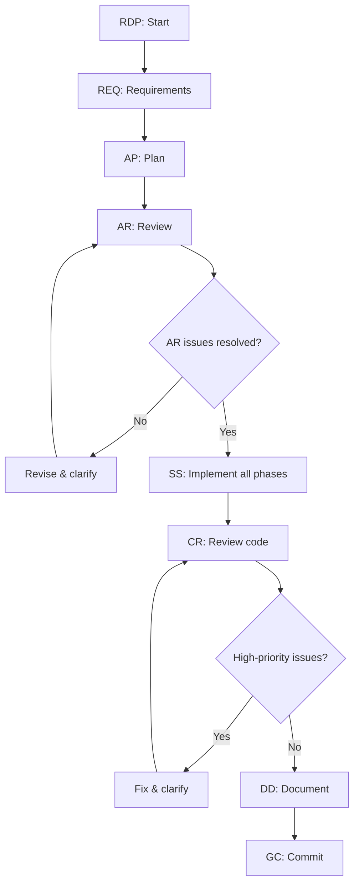

# RPD - Requirements, Planning, and Development Workflow

A structured workflow for software development, from requirements gathering through deployment.

## Trigger Matching Rules

- Match command keywords case-insensitively with token boundaries: `\b(RDP|REQ|AP|AR|SS|CC|DF|DD|TT|CR|GC)\b`.
- Treat wrapped/prefixed forms as valid triggers: `RDP ...`, `[RDP] ...`, `RDP: ...`, `/RDP ...`, and `(RDP) ...`.
- If multiple keywords appear in one message, use the earliest matched keyword as the primary command.
- Ignore partial-word matches (e.g., `reqs` or `drop`).

## Commands

### RDP - Full RPD Loop

Runs the full end-to-end loop: **REQ → AP → AR (iterate until resolved) → SS (all phases) → CR (fix until clean) → DD → GC**.

**Process**:
1. Run **REQ** to define requirements (WHAT, not HOW)
2. Run **AP** to create phased architecture plan
3. Run **AR** and iterate until review issues are addressed; ask for clarification if needed
4. Run **SS** across all phases and fully update plan progress
5. Run **CR** and fix until all high-priority findings are resolved; ask for clarification if needed
6. Run **DD** to document completed work
7. Run **GC** to commit with review-backed confidence

**Guardrails**:
- Do not exit AR until all critical assumptions and gaps are addressed or explicitly clarified.
- Do not exit CR until all high-priority issues are fixed or explicitly accepted by the user.
- If blocked by unclear requirements or tradeoffs, ask targeted clarification questions immediately.



---

### REQ - Requirements Documentation

Creates or updates requirement documents focusing on **what** is needed, not how.

**When to use**: Starting a new feature, clarifying needs, defining acceptance criteria.
**Output**: `.docs/reqs/{yyyy-mm-dd}/req-{name}.md`
**Auto-triggers**: AR

**Process**:
1. Analyze the user's request
2. Document requirements focusing on WHAT, not HOW
3. Define acceptance criteria
4. Automatically trigger AR

**Output template**:
```markdown
# Requirement: {Feature Name}
## Overview
## Goals
## Functional Requirements
## Non-Functional Requirements
## Constraints
## Acceptance Criteria
- [ ] Criterion 1
```

---

### AP - Architecture Planning

Creates architecture plan with phased implementation steps and markdown checkboxes.

**When to use**: Complex features, system design, breaking down large tasks.
**Output**: `.docs/plans/{yyyy-mm-dd}/plan-{name}.md`
**Auto-triggers**: AR

**Process**:
1. Review requirements (from REQ if available)
2. Design high-level architecture
3. Create phased implementation plan with checkboxes
4. Use mermaid diagrams for complex flows
5. Automatically trigger AR

**Output template**:
```markdown
# Architecture Plan: {Feature Name}
## Overview
## Architecture Decisions
## Components
## Data Flow (mermaid)
## Implementation Phases
### Phase 1: Foundation
- [ ] Task 1.1
### Phase 2: Core Features
- [ ] Task 2.1
## Dependencies & Risks
```

---

### AR - Architecture Review

Reviews architecture to validate assumptions, provide options, and update existing documents.

**When to use**: After REQ or AP, before heavy implementation.

**Process**:
1. Locate requirement and plan documents
2. Review for completeness, feasibility, scalability, maintainability, performance, security, testability
3. Validate assumptions and provide alternative approaches with pros/cons
4. Update existing documents in place (no new review document)

---

### SS - Step-by-Step Implementation

Implements the plan systematically, fixes errors, and updates plan with progress.

**When to use**: Executing architecture plans, implementing features methodically.

**Process**:
1. Locate and read plan document
2. Work through tasks in phase order, one at a time
3. Monitor for errors after each change; fix immediately
4. Update plan checkboxes as tasks complete (`- [x]`)
5. Test each phase before moving forward

---

### CC - Code Consolidation

Consolidates code by removing redundancy, dead code, and outdated comments.

**When to use**: Code cleanup, removing duplication, simplifying complex logic.

**Process**:
1. Analyze for duplicate code, dead paths, redundant comments
2. Verify code is truly unused before removing
3. Remove/consolidate systematically
4. Run tests to ensure nothing broke

**Targets**: Unused imports/variables, duplicate functions, commented-out code, dead code paths, overly complex logic, redundant comments.

---

### DF - Debug and Fix

Debugs issues by finding root cause and applying appropriate solution.

**When to use**: Runtime errors, compilation errors, test failures, logical bugs.

**Process**:
1. Identify the issue (error messages, stack traces)
2. Gather context (read files, check recent changes)
3. Find root cause (not just symptoms)
4. Explain the problem clearly
5. Apply fix and verify
6. Add regression tests

---

### DD - Document Done

Documents completed features in `.docs/done/{yyyy-mm-dd}/{name}.md`.

**When to use**: After completing features, for knowledge base, tracking deliverables.

**Process**:
1. Gather implementation details
2. Create document with: overview, implementation details, usage examples, testing info
3. Cross-reference related REQ and AP docs

---

### TT - Test and Fix

Runs test commands and fixes all failing tests systematically.

**When to use**: Running test suite, ensuring tests pass, verifying changes.

**Process**:
1. Run the project's test command (auto-detect from project config)
2. Analyze all failures
3. Fix one test/group at a time
4. Re-run after each fix until all pass

---

### CR - Code Review

Performs comprehensive code review using git to inspect uncommitted changes.

**When to use**: Before committing, ensuring quality.

**Process**:
1. Run `git diff` to get changes
2. Review: architecture, code quality, performance, security, testing, error handling, type safety
3. Categorize: critical (must fix), important (should fix), nice-to-have
4. **Automatically fix all critical issues** before reporting
5. Provide specific recommendations for remaining issues

---

### GC - Git Commit with Review

Performs CR first, then commits with clear conventional commit message.

**When to use**: Committing changes with quality assurance.
**Auto-triggers**: CR

**Process**:
1. Run CR automatically
2. Address critical issues if found
3. Stage changes and create conventional commit: `<type>(<scope>): <subject>`
4. Types: `feat`, `fix`, `docs`, `style`, `refactor`, `perf`, `test`, `chore`, `ci`, `revert`

---

## Automatic Triggers

- **REQ** → AR (auto)
- **AP** → AR (auto)
- **GC** → CR (auto)
- **RDP** → REQ → AP → AR loop → SS → CR loop → DD → GC

## Decision Matrix

| Situation | Commands |
|-----------|----------|
| End-to-end delivery | RDP |
| New big feature | REQ → AP → SS → TT → DD → GC |
| New small feature | SS → TT → GC |
| Bug fix | DF → TT → GC |
| Code cleanup | CC → TT → GC |
| UI feature | SS → TT → GC |
| Refactoring | AP → SS → TT → GC |

## General Rules

- **Requirements focus on WHAT**: When creating or analyzing requirements (REQ, AR), focus strictly on what is needed. Do not prescribe how to implement or suggest optimizations.
- **CR auto-fixes critical issues**: When CR finds critical issues, fix them automatically rather than just reporting them.
- **Compile after every change**: After any code modification, verify the project compiles with no errors before moving on. If errors are found, fix them immediately.
- **File header comments**: Maintain a comment block at the top of each source file summarizing features, implementation, and changes.

## Documentation Structure

```
.docs/
├── reqs/{yyyy-mm-dd}/req-{name}.md    # Requirements (REQ)
├── plans/{yyyy-mm-dd}/plan-{name}.md  # Plans (AP)
└── done/{yyyy-mm-dd}/{name}.md        # Completed (DD)
```
